# Web
# a. Цель работы
Разработать приложение-каталог кофеен "Э(к)спрессо".

# a. Решаемая проблема
Ввиду существования большого количества разнообразных кофеен, поиск среди них подходящего заведения может стать долгим и энергозатратным процессом для потребителя. По этой причине приложение-каталог, хранящее информацию о множестве кофеен в одном месте, способно сделать этот процесс более эффективным и удобным.

| Критерий| Кофейная карта | Coffee Forest| Яндекс карты |
|-------------|-------------|-------------|-------------|
| Возможность просмотра информации о кофейнях прямо в приложении  | +  | + | + |
| Возможность просмотра меню кофеен в приложении | - | - | + |
| Возможность составления списка избранных кофеен| + | + | - |
| Возможность составления списка избранных напитков| - | - | - |
| Возможность поиска кофеен на основе наличия в их меню определенного напитка| - | - | - |

# a. Предоставляемая возможность
В приложении собраны данные о сетях кофеен и напитках из их меню. Пользователю предоставляется интерфейс для просмотра упомянутой ранее информации, выбора напитка (среди всех имеющихся в приложении позиций) и поиска кофеен, в которых тот предлагается. Также приложение позволяет составлять список избранных напитков и список избранных кофеен. 

Возможность просмотра сведений о кофейнях и их меню сразу из приложения снимает с пользователя необходимость самостоятельно находить эту информацию через поисковые системы, посещая сайты заведений один за другим. 

Способность приложения-каталога показывать кофейни, в меню которых есть выбранный пользователем напиток, ускоряет процесс выбора заведения для потребителей, регулярно предпочитающих для себя одни и те же напитки, засчет того, что им не придется просматривать весь список имеющихся в системе кофеен. Приложение выдаст лишь те заведения, в которых предлагается данный напиток. Эта опция также полезна тем, что исключает ситуацию, при которой пользователь может найти кофейню, подходящую ему по описанию, но не подходящую по меню.

Список избранных напитков, который можно составлять в приложении, позволяет пользователю сохранять и впоследствии не забывать напитки, которые ему понравились или которые он хочет попробовать в будущем. Список избранных кофеен создан для той же цели.

# b. Краткий перечень функциональных требований
Приложение должно предоставлять возможность авторизации пользователей, которые разделяются на 4 типа (роли), каждый из которых обладает следующими возможностями:

| Роль| Возможности |
|-------------|-------------|
| Неавторизованный пользователь | Регистрация, авторизация |
| Авторизованный пользователь | Просмотр списка всех сетей кофеен, информации о них и их открытых точках; просмотр списка напитков, избранных напитков и избранных кофеен; добавление напитков и кофеен в избранные; поиск сети кофеен, в меню которой есть выбранный пользователем напиток; режактирование профиля и удаление аккаунта.| 
| Модератор  | Все возможности авторизованного пользователя, а также добавление/удаление позиций меню, напитков, сетей кофеен и их открытых точек.|
| Администратор| Все возможности модератора, а также просмотр списка пользователей, удаление пользователей и изменение их прав доступа.|

# c. Use-case диаграмма системы
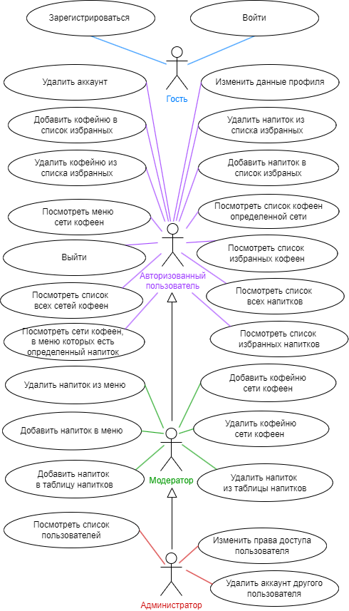

# d. BPMN диаграмма основных бизнес-процессов 
### 1. Регистрация
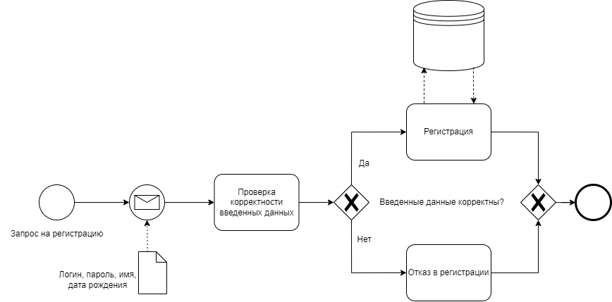

### 2. Авторизация
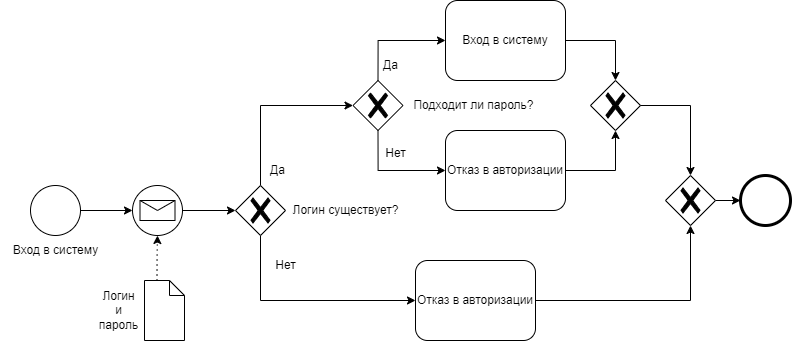

### 3. Получение списка кофеен, в меню которых есть напиток из списка избранных напитков
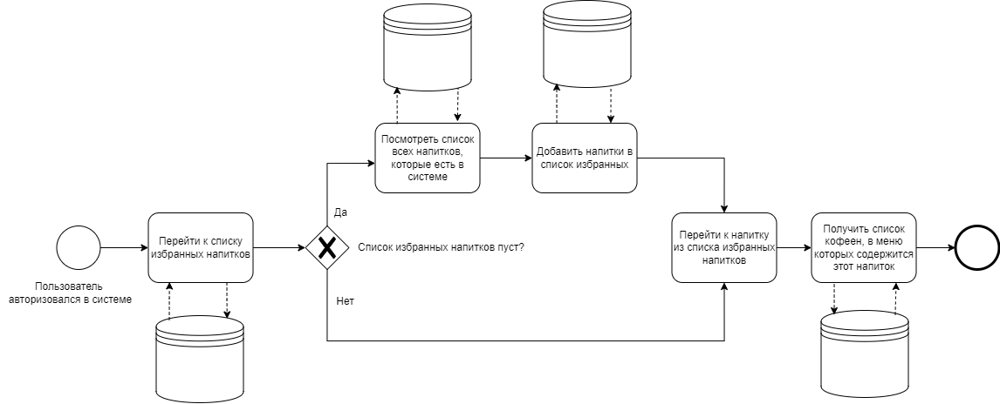

# e. Примеры описания основных пользовательских сценариев
Гость:
1. Зарегестрироваться
2. Войти

Авторизованный пользователь:
1. Войти
2. Посмотреть список сетей кофеен
3. Перейти к конкретной сети из списка
4. Посмотреть информацию о сети, ее меню и ее списке открытых кофеен
5. Вернуться на начальную страницу
6. Посмотреть список избранных напитков
7. Перейти к конкретному напитку и посмотреть список сетей кофеен, в меню которых этот напиток присутствует
8. Перейти к списку избранных кофеен и посмотреть меню какой-либо из них
9. Перейти в свой профиль, изменить данные аккаунта или удалить его

Модератор:
1. Войти
2. Посмотреть список сетей кофеен
3. Удалить какую-либо сеть из этого списка
4. Добавить новую сеть кофеен, а также добавить информацию о ее меню и открытых точках
5. Перейти к меню конкретной сети кофеен и добавить/удалить напиток.

Администратор:
1. Войти
2. Посмотреть список пользователей
3. Выдать права модератора/администратора кому-либо из пользователей
4. Отобрать права модератора/администратора у какого-то пользователя
5. Удалить аккаунты каких-то пользователей 

# f. ER-диаграмма сущностей
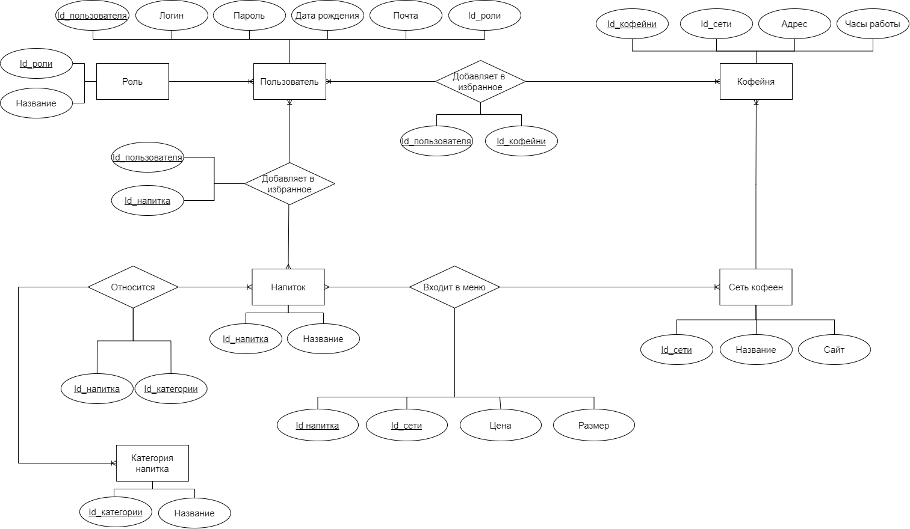

# g. Технологический стек 
## Backend 
* Язык - C#
* Фреймворк - ASP.NET Core
## Frontend 
<!-- * Язык - C# (с использованием Razor syntax)
* Фреймворк - ASP.NET Core MVC -->
* Язык - TypeScript
* Фреймворк - React.js

## СУБД 
* PоstgreSQL

## Механизм доставки приложения:
* Backend: Скомпилированное ASP.NET Core приложение (бинарник .dll), развернутое на сервере под управлением веб-сервера Kestrel (может быть упаковано в контейнер Docker)

* Frontend: HTML-страницы, генерируемые сервером на лету с помощью Razor-шаблонов и обслуживаемые непосредственно ASP.NET Core приложением.

* СУБД: Сервер PostgreSQL, развернутый рядом с бэкендом или как отдельный контейнер/сервис.

# h. Диаграмма БД
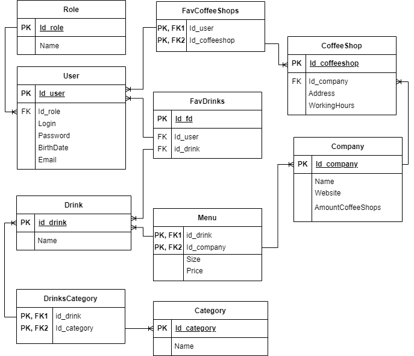

# i. Компонентная диаграмма системы
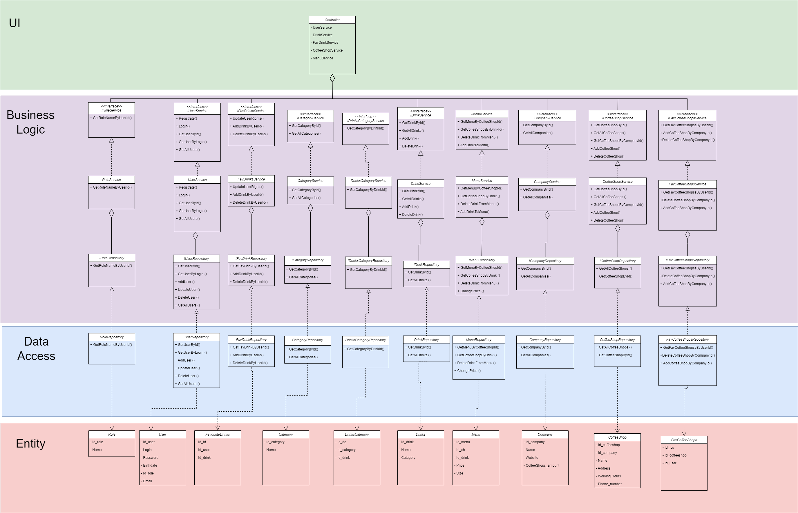

# j. Экраны будущего web-приложения на уровне черновых эскизов
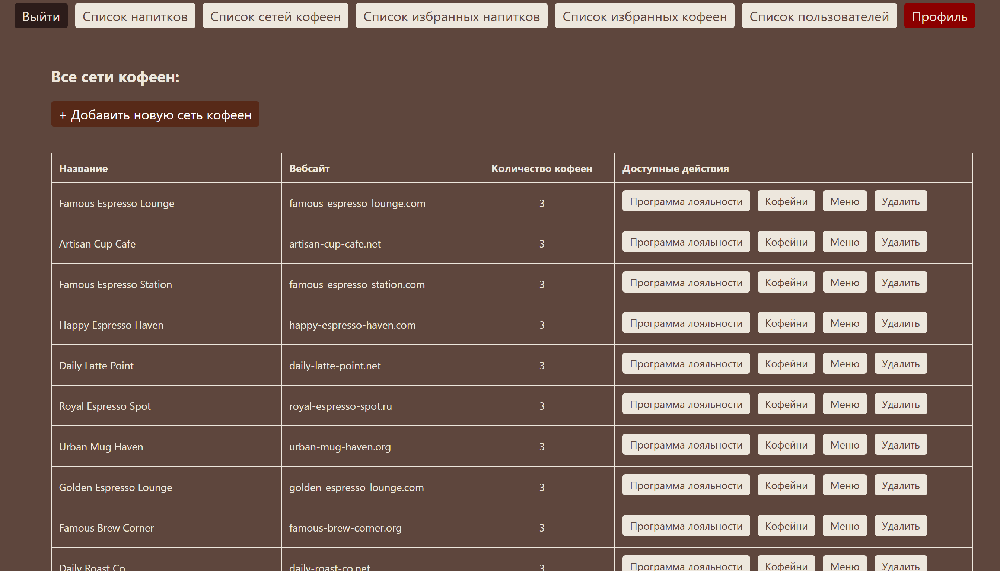

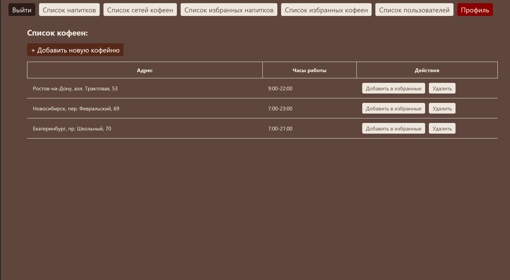

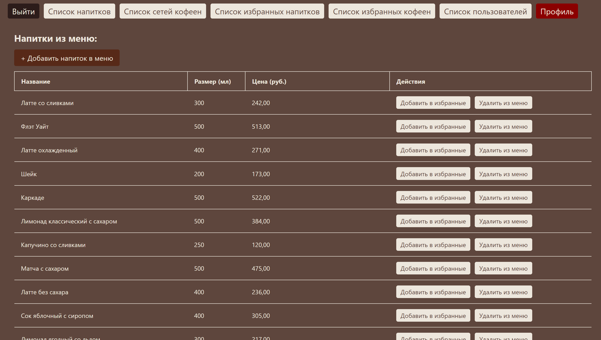

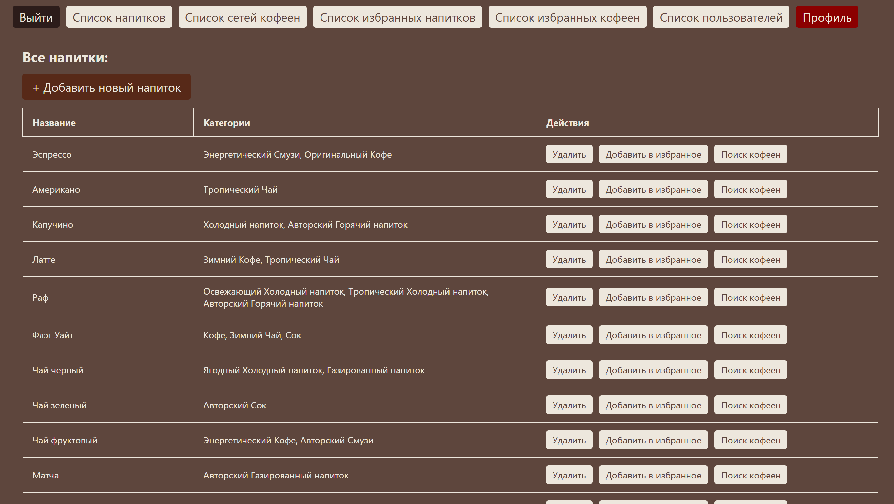

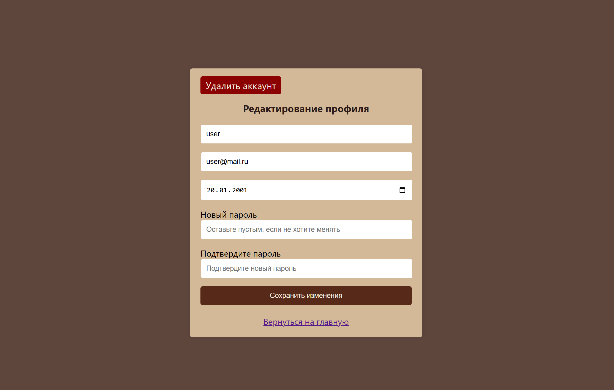

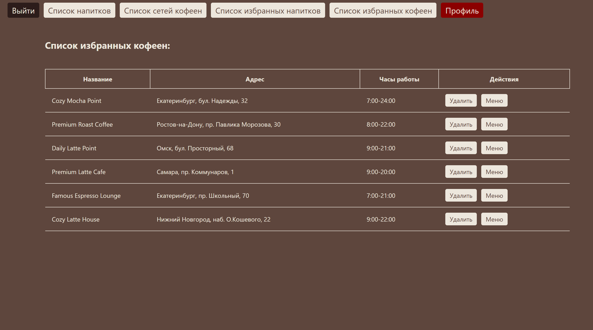

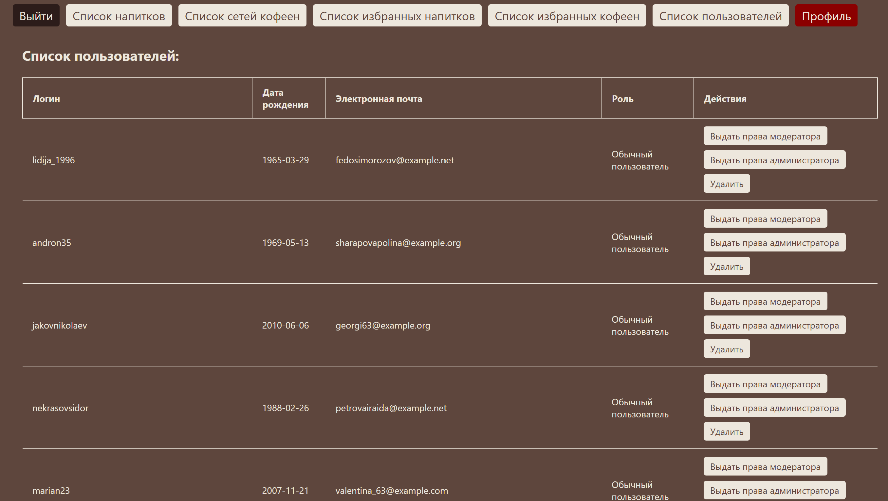
